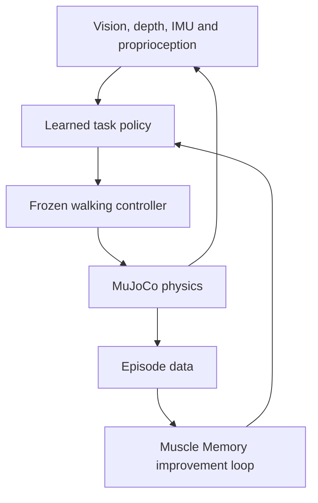

# Muscle Memory

**One robot. Many worlds. Experience that compounds.**

Muscle Memory is an adaptive simulation and training platform for household robots.

A user describes a household task and environment. Muscle Memory generates the required 3D obstacles, assembles a physics-valid world, trains one fixed robot across many variations, remembers why it failed, and produces progressively improved policy versions.

The robot never changes. Only its training worlds, experience, and learned policy improve.

Muscle Memory doesn't just teach a robot to complete one route. It helps the same robot accumulate experience that transfers across unfamiliar homes.

---

## The fixed robot: MM-01

The application uses one permanently fixed humanoid called **MM-01**.

MM-01 is independently inspired by the sensor and control architecture publicly described for the 1X NEO household robot. It is not affiliated with, endorsed by, or validated by 1X, which has not published its complete robot model, controller, or sensor API.

For stability, MM-01 is built from validated public components:

| Concern | Source |
| --- | --- |
| Articulated mechanical skeleton | Unitree G1 from [MuJoCo Menagerie](https://github.com/google-deepmind/mujoco_menagerie) |
| Low-level walking controller | Frozen controller from [MuJoCo Playground](https://github.com/google-deepmind/mujoco_playground) |
| Visual design | One fixed design; TRELLIS used at most once for non-colliding head/torso styling |

The robot's body, mass, dimensions, joints, sensors, and gait policy are **frozen**. A checksum is stored with every episode proving the same robot was used.

Muscle Memory trains only the robot's **high-level task policy**. It does not attempt to relearn standing, balance, or bipedal walking.

---

## Demonstration goal: Safe Household Delivery

> MM-01 must carry a medicine pouch from its charging area to a resident elsewhere in the apartment while avoiding household clutter and keeping the package stable.

The medicine pouch begins secured to a tray already held by the robot. **Grasping is excluded from the MVP.**

A run succeeds only if all of the following hold:

- Reaches the resident within **30 seconds**
- Stops within **0.5 m** while facing them
- No falls
- No body collisions
- Minimum obstacle clearance of **0.25 m**
- Tray tilt below **12°**
- No simulated package slip
- No human intervention

---

## Changing worlds

Muscle Memory generates new versions of the same bounded apartment environment.

The MVP supports:

- One **8 × 6 m** single-floor template
- Chairs, boxes, tables, stools, and laundry baskets
- Different obstacle arrangements
- Different start and destination positions
- Lighting and texture variations
- Floor-friction changes
- Camera and IMU noise
- One TRELLIS-generated hero obstacle

Every generated world must pass validation **before** training:

- No overlapping objects
- Start and destination are connected
- All passages meet minimum robot clearance
- Obstacles have approved colliders
- A valid baseline path exists
- Physical parameters remain within safe limits

Doors, stairs, grasping, moving pets, and multiple rooms are stretch goals.

---

## Asset-generation system

When the user requests a new obstacle:

1. An image model creates a clean isolated reference image.
2. **Microsoft TRELLIS.2-4B** converts it into a textured GLB.
3. The GLB is preserved for the browser visualization.
4. It is converted into an OBJ or compatible MuJoCo asset.
5. A **Physics Agent** proposes dimensions, mass, friction, static/movable status, semantic category, and collision shape.
6. A deterministic processor generates a primitive or convex collider.
7. The user approves uncertain physical properties.
8. The validated asset enters Muscle Memory's obstacle library.

The detailed generated mesh is for **appearance only**. Physics always uses simplified collision geometry.

---

## MM-01 sensor profile

MM-01 targets the sensor modalities publicly described for 1X NEO.

| Sensor | Muscle Memory implementation | Application usage |
| --- | --- | --- |
| Stereo vision | Two head-relative rendered RGB views with a fixed 0.07 m baseline | Robot POV and obstacle perception |
| Stereo-derived depth | 48 OpenCV SGBM sectors calculated from the RGB pair | Primary navigation input |
| Linkwise IMUs | Existing pelvis and torso acceleration, angular velocity, and orientation; head and limb channels unavailable | Balance and motion awareness |
| Joint proprioception | Joint position, velocity, actuator effort | Low-level control and diagnostics |
| Foot contacts | Existing left/right force and floor-contact state; centre of pressure unavailable | Stability monitoring |
| Wrist and tray | Tray tilt from external payload physics; force-torque channel unavailable | Tray balance |
| Hand and package | Relative-pose slip state; pressure and shear channels unavailable | Package-slip detection |
| Audio | Unavailable in the current fixed profile | Logged-only placeholder |
| Battery | Actuator power and integrated energy; charge percentage unavailable | System monitoring |

Official 1X information describes dual stereo fisheye cameras, linkwise IMUs, four beamforming microphones, joint positions and applied forces, and tactile hand sensing. Those public descriptions motivate the category rail, but unavailable MM-01 channels remain visibly unavailable rather than simulated as working signals. See [NEO specifications](https://www.1x.tech/neo), [Redwood AI](https://www.1x.tech/discover/redwood-ai), and [NEO hands](https://www.1x.tech/discover/neos-hands).

### Recommended simulation rates

| Layer | Rate |
| --- | --- |
| Physics | 500–1,000 Hz |
| Frozen walking controller | 100 Hz |
| Learned task policy | 5–10 Hz |
| Numeric telemetry | 20 Hz |
| Dashboard charts | 10 Hz |
| Robot POV | 30 FPS |

### Run the verified simulator

Python 3.12 is pinned by `.python-version`, and `uv.lock` fixes the environment.

```bash
uv sync --frozen --group dev
uv run mm-verify-robot
uv run mm-smoke
uv run ruff check .
uv run mypy src
uv run pytest
```

`mm-verify-robot` fails closed unless the qualified 100 Hz controller, complete frozen robot
identity, physical qualification measurements, raw trials, parity record, and completed
training contract all match `config/robot/mm01-v1.json` byte for byte.

---

## Hierarchical control system



### Frozen walking controller

Responsible for standing, balance, walking, turning, foot placement, joint-torque control, and fall prevention.

### Learned task policy

**Inputs:** stereo-derived depth sectors · destination distance and bearing · torso orientation and angular velocity · base velocity · joint-effort summary · foot-contact state · tray orientation · package-slip status · previous action

**Outputs:** forward speed · turning rate · stop probability

During evaluation, agents do not control the robot. The trained policy receives sensor data and acts independently.

---

## Training method

Imitation learning first, reinforcement learning optionally after it is stable.

1. Generate validated apartment worlds.
2. Use A* to create expert paths.
3. Convert those paths into training actions.
4. Allow the user to draw a safer route or keep-out region.
5. Add that demonstration to the training dataset.
6. Behavior-clone a small navigation policy.
7. Evaluate it **without** access to A*.
8. Identify recurring failure patterns.
9. Generate targeted worlds containing similar challenges.
10. Fine-tune the policy.
11. Optionally use PPO after the behavior-cloning system is stable.

A* acts only as a teacher and is unavailable during final evaluation.

---

## What "memory" means

| Memory | Location | Purpose |
| --- | --- | --- |
| Live experience | **LaserData** | Sensor readings, actions, rewards, collisions, interventions |
| Explicit experience | **FalkorDB** | Relationships between worlds, obstacles, failures, lessons, policy versions |
| Behavioral memory | **Policy checkpoint** | Neural-network weights controlling the robot |

FalkorDB does not directly move the robot. It helps the agents decide which experiences matter and what the robot should practise next.

---

## Sponsor architecture

### LaserData — live nervous system

Streams camera-frame metadata, IMU readings, joint positions and effort, foot contacts, hand tactile state, tray orientation, audio activity, policy actions, collisions, training metrics, and episode completion.

Video can stream directly to the interface, while LaserData carries synchronized frame IDs and event metadata.

### FalkorDB — long-term experience graph

Stores MM-01, sensor configuration, policy versions, worlds and obstacles, episodes, failures, human corrections, lessons, and evaluation results.

Example relationships:

```
Episode      → FAILED_NEAR   → LaundryBasket
Episode      → USED          → PolicyV0
Correction   → PRODUCED      → ClearanceLesson
ClearanceLesson → TRAINED_INTO → PolicyV1
PolicyV1     → OUTPERFORMED  → PolicyV0
```

Multi-hop queries select the next training curriculum.

### Guild.ai — specialist coordination

Coordinates three agents:

- World and Physics Agent
- Failure and Curriculum Agent
- Safety and Evaluation Agent

Guild.ai also handles human approval for questionable physical properties, reward changes, curriculum changes, and policy promotion.

### RocketRide — execution engine

```
validate world → run episode → summarize telemetry → query graph memory
→ select curriculum → train candidate policy → evaluate candidate
→ promote or roll back
```

Guild.ai decides who reasons. RocketRide executes the approved tools.

---

## User interface

**Top bar** — MM-01 · current policy version · world seed · training or evaluation mode · task progress · sensor-stream health

**Main simulation** — a large third-person view showing MM-01 and the apartment, the destination zone, current and previous paths, obstacle risk, clearance boundaries, and contacts/collisions

**Robot POV** — a pinned first-person view with left-eye RGB, right-eye RGB, stereo composite, derived depth, and simulator-debug segmentation. Minimal HUD: current action, destination direction, nearest hazard, speed, tray tilt, collision warning.

**Sensor rail** — expandable panels for:

1. Stereo vision and depth
2. Linkwise IMUs
3. Joint position and effort
4. Foot contacts
5. Wrist force and tray balance
6. Hand pressure and slip
7. Microphone activity
8. Battery and energy

Every signal must be labeled as **Used by policy**, **Logged only**, or **Simulator ground truth**.

**Bottom timeline** — live LaserData events · reward and completion progress · collision and intervention markers · retrieved FalkorDB lesson · current RocketRide workflow step · episode replay controls

---

## Proving improvement

Freeze **20 validation worlds** before training. Never expose them to the learner.

Evaluate V0 and V1 on identical seeds and compare: success rate, collisions per episode, falls, completion time, path efficiency, minimum clearance, tray tilt, package slips, energy per successful delivery, human interventions, and performance on unseen worlds.

### Policy-promotion gate

- At least **80%** held-out success
- **Zero** falls
- No more than **10%** collision rate
- Median clearance of at least **0.25 m**
- At least **20 percentage points** higher success **or** **50% fewer** collisions than V0
- No more than **15%** regression in path efficiency

Taking different actions on identical input is **not** proof of learning. Muscle Memory proves learning through improved performance across unseen worlds.

---

## Stable version definition

Muscle Memory v1 is complete when it can:

- Load the identical MM-01 robot every time
- Walk stably for at least 60 seconds
- Generate and validate at least 20 layouts
- Display synchronized third-person and robot-POV views
- Show every sensor category
- Save and replay an episode
- Accept one user route correction
- Train or restore an improved checkpoint
- Compare V0 and V1 on the same held-out worlds
- Display measured improvement statistics
- Promote or roll back a policy
- Complete one unseen delivery run independently

Cached TRELLIS assets and verified policy checkpoints protect the critical demo. Live asset generation and training can still be shown, but Muscle Memory must finish the demonstration if either times out.

---

## Demo sequence

1. Select the fixed MM-01 robot.
2. Generate a new apartment.
3. Run baseline Policy V0.
4. Show the robot POV and live sensor dashboard.
5. V0 collides or takes an unsafe route.
6. LaserData closes the episode.
7. FalkorDB retrieves a related failure.
8. Guild.ai's Curriculum Agent proposes a correction.
9. The user approves it.
10. RocketRide trains and evaluates Policy V1.
11. V1 completes an unseen apartment independently.
12. Display measured V0-versus-V1 improvement.

---

> **Muscle Memory gives one robot a lifetime of experience — before it ever enters your home.**
