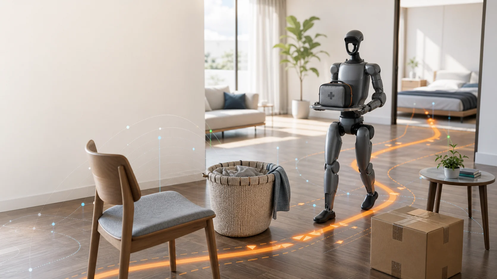
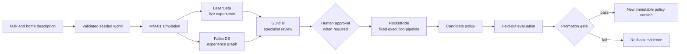
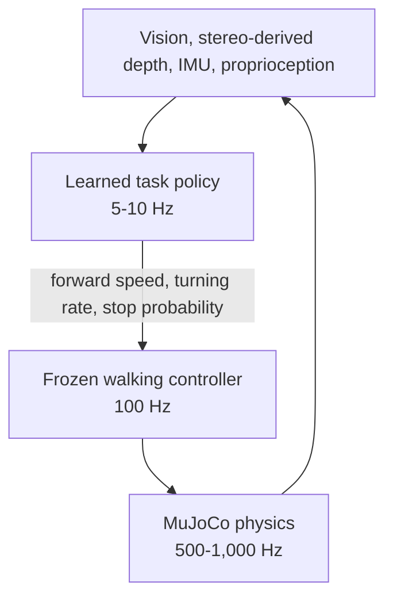

<div align="center">

# Muscle Memory

**One robot. Many worlds. Experience that compounds.**

<a href="https://musclememory.space">
  
</a>

<br>

[](https://musclememory.space)


### [Open Muscle Memory at musclememory.space](https://musclememory.space)

[See the idea](#the-idea) | [Explore the architecture](#how-it-works) | [Meet MM-01](#meet-mm-01) | [Run it locally](#run-the-app)

</div>

---

## The idea

A household robot should not have to relearn the same lesson every time the furniture moves.

**Muscle Memory** is an adaptive simulation and training platform for household robots. You
describe a task and a home environment; the system builds a physics-valid world, runs one fixed
robot through it, remembers what went wrong, and uses that experience to train the next policy.

The important constraint is simple:

> **The robot never changes. Its worlds, experience, and learned high-level policy do.**

That turns isolated simulation runs into a growing body of experience that can transfer across
unfamiliar homes.

| Fixed foundation | Changing experience | Proof before promotion |
| --- | --- | --- |
| One permanently identified MM-01 robot | Seeded apartments, obstacles, corrections, and lessons | Candidate policies face 20 structurally isolated held-out worlds |
| Frozen 100 Hz walking controller | A learned 5-10 Hz task policy | Success, collisions, falls, clearance, efficiency, and package stability are measured |
| The same body, sensors, and gait policy in every episode | New immutable policy versions | Failed candidates remain rollback evidence |

## The mission

The demonstration task is **safe household delivery**:

> MM-01 carries a medicine pouch from its charging area to a resident elsewhere in an apartment,
> avoiding clutter while keeping the package stable.

The pouch starts secured to a tray already held by the robot. Grasping is intentionally outside
the MVP so the project can focus on navigation, safety, memory, and measurable improvement.

A run succeeds only when every condition is satisfied:

| Goal | Required result |
| --- | --- |
| Delivery | Reach the resident within 30 seconds |
| Final pose | Stop within 0.5 m while facing the resident |
| Stability | No falls and tray tilt below 12 degrees |
| Safety | No body collisions and at least 0.25 m obstacle clearance |
| Package | No simulated slip |
| Autonomy | No human intervention during the run |

## How it works



The loop has deliberately separate responsibilities:

1. Generate a deterministic apartment world and reject it unless every validation check passes.
2. Run MM-01 with its frozen locomotion controller and current high-level policy.
3. Record operational telemetry and convert episode outcomes into explicit experience.
4. Find recurring failure patterns and propose a targeted curriculum.
5. Require human approval for uncertain physics, reward changes, curriculum changes, and policy decisions.
6. Train a new version, evaluate it on unseen worlds, then promote or roll it back using numeric gates.

## Meet MM-01

MM-01 is the project's permanently fixed humanoid. It is independently inspired by the sensor
and control architecture publicly described for the 1X NEO household robot. Muscle Memory is not
affiliated with, endorsed by, or validated by 1X, which has not published its complete robot
model, controller, or sensor API.

| Concern | Validated source |
| --- | --- |
| Articulated skeleton | Unitree G1 from [MuJoCo Menagerie](https://github.com/google-deepmind/mujoco_menagerie) |
| Low-level locomotion | Frozen controller from [MuJoCo Playground](https://github.com/google-deepmind/mujoco_playground) |
| Visual styling | One fixed design; TRELLIS may be used once for non-colliding head and torso appearance |

MM-01's body, mass, dimensions, joints, sensors, and gait policy are frozen. Every episode carries
the robot checksum, making robot identity part of the evidence rather than an assumption.

### Hierarchical control



The learned policy chooses only **forward speed**, **turning rate**, and **stop probability**.
Standing, balance, foot placement, torque control, and fall prevention remain the responsibility
of the frozen walking controller.

A* creates expert paths for behavior cloning during training. It is a teacher only and is
unreachable from evaluation, where the policy acts from sensor input alone.

<details>
<summary><strong>Open the complete sensor profile</strong></summary>

| Sensor category | MM-01 implementation | Product use |
| --- | --- | --- |
| Stereo vision | Two head-relative RGB views with a fixed 0.07 m baseline | Robot POV and obstacle perception |
| Stereo-derived depth | 48 OpenCV SGBM sectors calculated from the RGB pair | Primary navigation input |
| Linkwise IMUs | Pelvis and torso acceleration, angular velocity, and orientation | Balance and motion awareness |
| Joint proprioception | Position, velocity, and actuator effort | Low-level control and diagnostics |
| Foot contacts | Left and right force plus floor-contact state | Stability monitoring |
| Wrist and tray | Tray tilt from external payload physics | Package stability |
| Hand and package | Relative-pose slip state | Slip detection |
| Audio | Unavailable in the fixed profile | Visible logged-only placeholder |
| Battery | Actuator power and integrated energy | System monitoring |

Every UI signal is labeled **Used by policy**, **Logged only**, or **Simulator ground truth**.
Unavailable channels stay visible as unavailable instead of being presented as working data.

### Runtime rates

| Layer | Rate |
| --- | --- |
| Physics | 500-1,000 Hz |
| Frozen walking controller | 100 Hz |
| Learned task policy | 5-10 Hz |
| Numeric telemetry | 20 Hz |
| Dashboard charts | 10 Hz |
| Robot POV | 30 FPS |

</details>

## Worlds that change safely

The MVP generates versions of a bounded 8 x 6 m, single-floor apartment. Chairs, boxes, tables,
stools, laundry baskets, start positions, destinations, lighting, textures, friction, and sensor
noise can vary while the robot remains identical.

No world reaches training or evaluation until it proves:

- Objects do not overlap.
- Start and destination remain connected.
- Every passage meets minimum robot clearance.
- Every obstacle uses an approved collider.
- A valid baseline path exists.
- Physical parameters remain inside safe bounds.

When a new obstacle is requested, an image model creates an isolated reference and Microsoft
TRELLIS.2-4B produces a textured GLB. That detailed mesh is visual only. A deterministic
processor creates the primitive or convex collider used by MuJoCo, and uncertain physical
properties require human approval before admission.

## The memory stack

The platform treats memory as three different things, each with a clear boundary:

| Technology | What it remembers | Why it matters |
| --- | --- | --- |
| **LaserData** | Ordered sensor readings, actions, rewards, collisions, interventions, frame metadata, and episode closure | Supplies the append-only operational record behind live monitoring and exact replay |
| **FalkorDB** | Worlds, obstacles, failures, corrections, lessons, evaluations, and immutable policy versions | Connects one failure to related experience and makes multi-hop curriculum queries possible |
| **Policy checkpoints** | The learned behavior itself | Gives every evaluated behavior a versioned, immutable identity |

Video can travel directly to the interface, while LaserData carries synchronized event metadata.
`frame_id` is the single join key between those two streams. FalkorDB stays outside the robot's
control path; it informs later curriculum decisions but never directly moves MM-01.

## Sponsor-powered orchestration

| Sponsor technology | Responsibility in Muscle Memory |
| --- | --- |
| **LaserData** | The live nervous system for append-only episode telemetry and provider-confirmed replay |
| **FalkorDB** | The long-term experience graph linking failures, lessons, worlds, and policy evidence |
| **Guild.ai** | Three distinct specialist agents for world physics, failure curriculum, and safety evaluation |
| **RocketRide** | The fixed executor that runs reviewed steps in order and stops at blocking human gates |

The operating principle is: **Guild.ai decides who reasons; RocketRide executes the approved
tools.** Neither is allowed to silently take the other's role.

```text
validate world -> run episode -> summarize telemetry -> query graph memory
-> select curriculum -> train candidate -> evaluate candidate -> promote or roll back
```

Live asset generation and training both have timeouts and verified cached fallbacks. The demo can
finish even when an external generation or training call cannot.

## The product experience

The website has two connected surfaces:

- **Landing experience:** an interactive Three.js household scene that introduces the task and
  shows how experience changes behavior.
- **Operator console:** live simulation, third-person view, robot POV, policy selection, world
  selection, episode progress, approvals, replay, and provider health.
- **Episode Review:** a searchable operational ledger with persisted operator notes, reversible
  note archiving, and a versioned JSON export of the selected episode evidence.
- **Training history:** each bounded task-policy job writes an atomic manifest beside its immutable
  artifacts. A restart reports interrupted work as `failed/process_restart` instead of losing it.

The console's **Run demo loop** is an explicit synthetic preview for environments without an
admitted live catalog and evaluated checkpoint. It is labeled as synthetic, can be exited back to
live data, and is never used as provider-backed episode evidence.

The console keeps all eight sensor categories visible. Its bottom timeline combines LaserData
events, completion progress, safety markers, retrieved FalkorDB lessons, the current RocketRide
step, and replay controls.

## Improvement must be measured

Twenty validation worlds are frozen before training and structurally isolated from curriculum
generation, failure mining, and hyperparameter selection. Baseline and candidate policies run on
identical seeds.

### Promotion gate

A candidate needs all of the following:

- At least 80% held-out success.
- Zero falls.
- No more than a 10% collision-episode rate.
- Median clearance of at least 0.25 m.
- At least 20 percentage points more success or 50% fewer collisions than the baseline.
- No more than 15% regression in path efficiency.

Different actions on identical input are not evidence of learning. Only measured improvement on
the held-out worlds can promote a policy.

<details>
<summary><strong>Current policy evidence</strong></summary>

No learned checkpoint is promoted yet.

- `delivery-v1` was rejected after its paired held-out evaluation. It matched V0 at 45% success,
  produced a 25% collision-episode rate, and recorded five falls.
- `delivery-v2-sensor-fusion-hysteresis` improved over V0 on its final disjoint development audit
  (66.7% versus 25% success, 8.3% collision episodes, and 0.315 m median clearance), but two falls
  and sub-80% success rejected it before held-out access.

Those failures are retained as immutable rollback evidence, not rewritten into a success story.

</details>

## Repository map

```text
frontend/          React, Three.js, landing experience, and operator console
src/muscle_memory/ Simulation, policy, telemetry, memory, orchestration, and API domains
config/            Frozen robot, world, service, and evaluation contracts
integrations/      Reviewed external integration artifacts
ops/               Verification, deployment, evidence, and maintenance commands
tests/             Contract, safety, provider, API, and simulation coverage
docs/              Deeper architectural and operational documentation
```

Useful deep dives:

- [System architecture](docs/architecture.md)
- [Live simulation](docs/live-simulation.md)
- [Sponsor orchestration](docs/sponsor-orchestration.md)
- [Policy evidence integrity](docs/policy-evidence-integrity.md)
- [HTTP API](docs/http-api.md)
- [Production deployment](docs/daytona-deployment.md)

## Run the app

### Prerequisites

- Docker Desktop with Docker Compose
- Node.js 22 or newer with npm
- Python 3.12 and [`uv`](https://docs.astral.sh/uv/) for verification and development commands

### 1. Start the API and local provider stack

From the repository root:

```bash
./ops/deployment/start.sh
```

The script creates an ignored, permission-restricted `.env.backend.local` when needed, then starts
the FastAPI service, a local LaserData-compatible data plane, and FalkorDB. It verifies the
provider handoffs before reporting the backend ready at `http://127.0.0.1:8000`.

### 2. Start the web interface

In a second terminal:

```bash
cd frontend
npm ci
npm run dev
```

Open **[http://127.0.0.1:4173](http://127.0.0.1:4173)**. Vite proxies API and WebSocket traffic to
the backend, so the landing page and operator console work from one browser origin.

For authenticated operator actions, read the generated local credential and enter it in the
console's **Operator credential** field:

```bash
sed -n 's/^MM_API_OPERATOR_TOKEN=//p' .env.backend.local
```

The browser keeps that value in the current tab's `sessionStorage`; it is not written into a URL
or persistent browser storage.

### 3. Verify the project

```bash
uv sync --frozen --group dev
uv run mm-verify-robot
uv run mm-smoke
uv run python -m ops.api.validate_openapi
uv run ruff check .
uv run mypy src
uv run pytest
cd frontend
npm run lint
npm run build
npx playwright install chromium
npm run test:e2e
```

`mm-verify-robot` fails closed if the frozen robot identity, controller, qualification evidence,
or training contract differs from the checked-in MM-01 bundle.

### 4. Stop the local stack

```bash
docker compose --env-file .env.backend.local down
```
